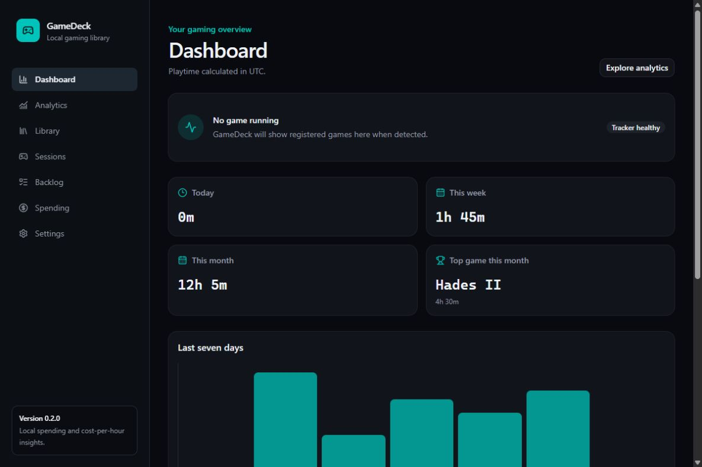
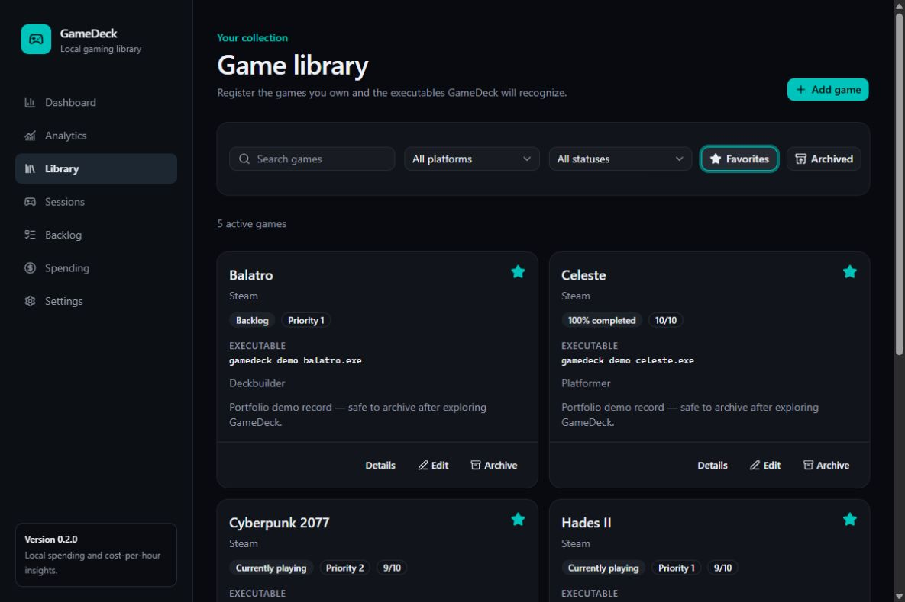
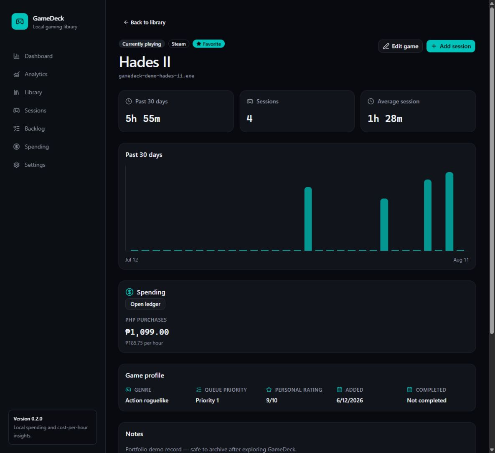
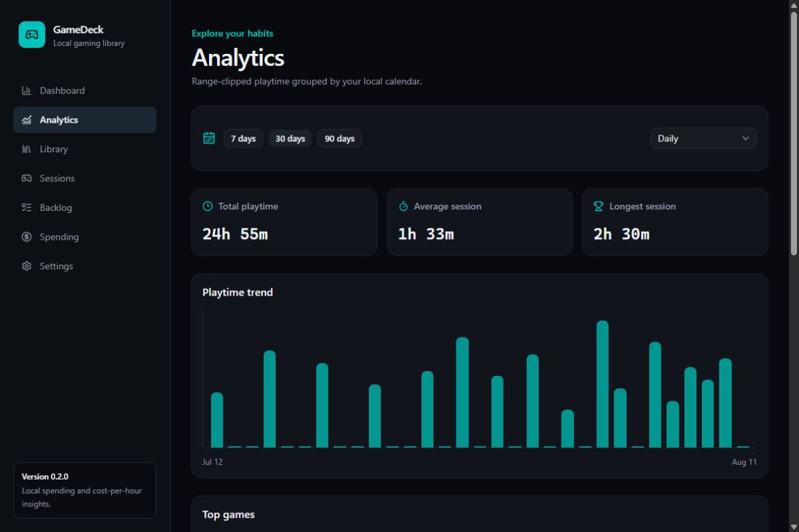
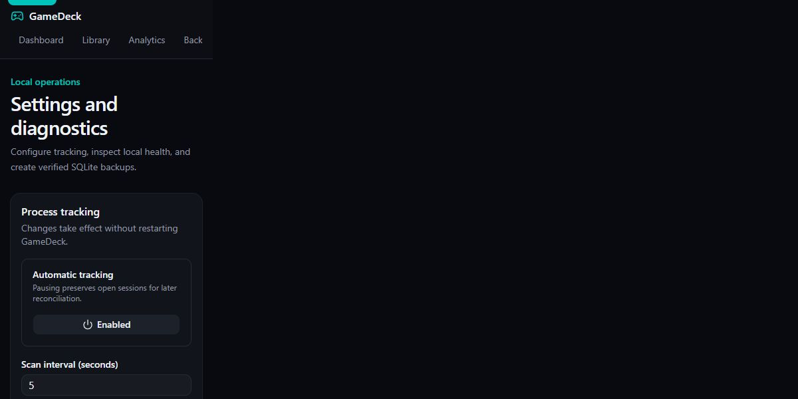
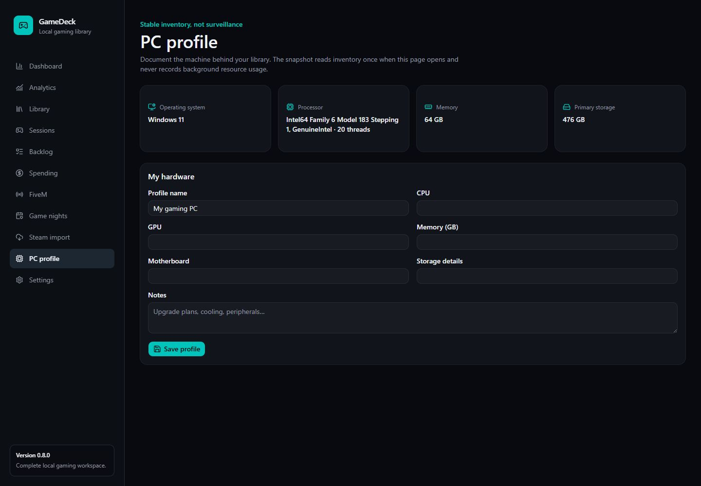
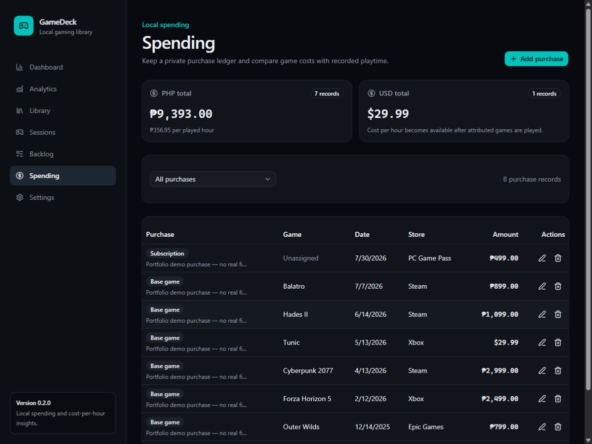
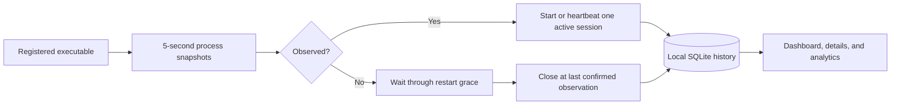

# GameDeck

**A local-first Windows dashboard for curating a game library and turning process observations into trustworthy play history.**



GameDeck works offline with no account or cloud service. It automatically discovers locally installed Steam games and can recognize an unlisted foreground game from any launcher, records recoverable sessions, and powers an auditable dashboard, analytics explorer, backlog, and private spending ledger.

## What makes it interesting

- **Reliable session tracking:** idempotent transitions plus a database constraint prevent duplicate active sessions through repeated scans and races.
- **Honest recovery:** heartbeats, restart grace, and startup reconciliation preserve history without pretending an offline stop time is knowable.
- **Correct local-time analytics:** interval clipping splits crossed-midnight sessions across the right calendar buckets.
- **Operationally complete:** migrations, WAL/busy handling, rotating logs, diagnostics, verified backups, error states, and Windows CI.
- **Private by default:** game metadata, process observations, and play history remain in local SQLite files.
- **Optional spending insights:** manual purchase records and cost-per-hour stay local, with currencies reported separately and never silently converted.
- **Automatic Steam discovery:** read local Steam manifests across multiple library folders without credentials, import installed games idempotently, and track executables launched from each game directory.
- **Launcher-independent detection:** an unknown visible executable held in the foreground for 15 seconds is registered locally and tracked, while browsers, launchers, installers, Windows components, and common utilities are ignored.
- **Automatic local artwork:** prefer high-resolution Steam client headers, then Valve-hosted art, confidently matched Wikipedia game covers, and finally embedded executable icons; manual cover choices are never overwritten.
- **Multi-executable recognition:** explicitly map alternate builds or launchers to one game without creating duplicate sessions.
- **Personal companion tools:** FiveM favorites, game-night RSVPs, Discord-ready announcements, Steam library preview/import, and a local PC profile.
- **Windows desktop-ready:** a Tauri shell owns the bundled FastAPI sidecar and keeps application data under the current user's local profile.

## Two-minute tour

| Dashboard | Library |
|---|---|
|  |  |
| **Game details** | **Analytics** |
|  |  |
| **Tracker and diagnostics** | |
|  | |

### Complete local workspace



### Optional local integrations



The first optional integration is deliberately offline: record base games, DLC, subscriptions, or other purchases in integer minor units. Totals and cost-per-hour are grouped by currency; GameDeck performs no exchange-rate conversion. See the [integration proposal](docs/integrations/spending.md).

The next local integration supports up to 10 executable aliases per game. Active filenames remain unique across the library, optional paths keep matching precise, and every alias feeds the same single-session lifecycle. See the [executable aliases proposal](docs/integrations/executable-aliases.md).

The completed roadmap also includes [FiveM favorites](docs/integrations/fivem-companion.md), [local game nights](docs/integrations/game-nights.md), [preview-first Steam import](docs/integrations/steam-import.md), [desktop packaging](docs/integrations/desktop-packaging.md), and a [PC profile](docs/integrations/pc-profile.md). Automatic Discord transmission and cloud sync are intentionally rejected in [ADR 0004](docs/decisions/0004-local-first-integration-boundary.md).

Follow the [90-second demo script](docs/demo.md), or create the same deterministic sample library with the command below.

## Quick start

Requirements: Windows 10/11, Python 3.12, Node.js 22, and pnpm 10 or newer.

```powershell
git clone <your-repository-url> GameDeck
cd GameDeck
powershell -ExecutionPolicy Bypass -File .\scripts\setup.ps1
  # Optional: adds fictional portfolio/demo data
  .\scripts\seed-demo.ps1
```

Start the API in one PowerShell window:

```powershell
cd backend
.\.venv\Scripts\python.exe -m uvicorn gamedeck.main:app --reload
```

Start the interface in another:

```powershell
cd frontend
pnpm dev
```

Open <http://127.0.0.1:5173>. API health and interactive OpenAPI documentation are at <http://127.0.0.1:8000/health> and <http://127.0.0.1:8000/docs>. Run exactly one API worker because it owns the process tracker.

The sample command is optional and intended only for screenshots or portfolio demos. It adds eight fictional games, sessions, and purchases to the current database. Pin its dates with `.\scripts\seed-demo.ps1 -At "2026-08-11T12:00:00Z"`, or point it to an isolated SQLite URL with `-DatabaseUrl`.

## How tracking works



A snapshot error does not count as process absence, so it never closes every active session. After an application restart, a still-running game keeps its session; an absent game closes at its last heartbeat. Unlisted Steam games are resolved immediately from local manifests. Other unlisted games must remain the active foreground window for 15 seconds before GameDeck adds a local entry; this confirmation delay and a utility exclusion list reduce false detections. Once registered, the executable continues to be tracked while it is running, even in the background. See the full [architecture](docs/architecture.md) and [operations/recovery guide](docs/operations.md).

## Technology and structure

- React 19, TypeScript, Vite, Tailwind CSS, and owned shadcn/ui-style primitives
- FastAPI, Pydantic, SQLAlchemy 2, Alembic, psutil, and SQLite WAL
- pytest integration/state-machine coverage and Vitest component/interaction coverage

```text
backend/      API, domain services, monitor, persistence, migrations, tests
frontend/     routed interface, API clients, feature components, tests
docs/         architecture, decisions, operations, demo, screenshots
scripts/      repeatable Windows setup, demo seed, and verification
```

## Configuration and local data

Copy `backend/.env.example` to `backend/.env` for overrides. All variables begin with `GAMEDECK_`.

Local Steam discovery normally finds Steam through the Windows registry. Set `GAMEDECK_STEAM_PATH` only when Steam is installed in a portable or otherwise nonstandard location. Discovery reads `libraryfolders.vdf` and installed `appmanifest_*.acf` files; it does not need a Steam account, password, or Web API key.

| Variable | Default | Purpose |
|---|---|---|
| `GAMEDECK_DATABASE_URL` | `sqlite:///backend/data/gamedeck.db` | Local SQLAlchemy database URL |
| `GAMEDECK_LOG_LEVEL` | `INFO` | Application log level |
| `GAMEDECK_LOG_DIR` | `backend/logs` | Rotating logs |
| `GAMEDECK_BACKUP_DIR` | `backend/backups` | Verified backup files |
| `GAMEDECK_ARTWORK_DIR` | `backend/data/artwork` | Locally cached Steam art and executable icons |
| `GAMEDECK_STEAM_PATH` | Windows registry | Optional nonstandard Steam installation path |
| `GAMEDECK_SQLITE_BUSY_TIMEOUT_MS` | `5000` | Bounded write-lock wait |

Database, log, backup, and `.env` contents are ignored by Git. Backups include the purchase ledger, remain local and unencrypted, and should be protected like the main database.

## Verification

```powershell
.\scripts\verify.ps1
```

This runs the backend regression suite, migration upgrade/check, frontend component suite, lint, and production build. Tests use temporary databases and never modify the development database. The same checks run on `windows-latest` in [CI](.github/workflows/ci.yml).

If the repository path contains `#`, an upstream Vite/Vitest Windows URL-resolution issue can truncate component-test paths. Use a checkout such as `C:\Projects\GameDeck`; the production build is unaffected.

## Engineering notes

The project emphasizes a mocked, controllable process source; layered active-session uniqueness; bounded SQLite failure handling; and timezone-aware interval arithmetic. Important tradeoffs are recorded in [architecture decisions](docs/decisions/), and the original phased scope remains in [GAMEDECK_TECHNICAL_PLAN.md](GAMEDECK_TECHNICAL_PLAN.md).

Known limits: very short sessions can fall between polls; restricted Windows process paths may require unique name matching or prevent icon extraction; generic launcher-independent detection is heuristic and requires 15 seconds of foreground activity; online artwork needs an internet connection on its first cache fill and title matching intentionally refuses ambiguous results; exact offline stop time cannot be reconstructed; one backend worker is required; backups are manual and local; Steam Web API preview needs a private key and visible library; the desktop installer requires the documented Windows toolchain or packaging workflow.

## Contributing and license

Read [CONTRIBUTING.md](CONTRIBUTING.md), [SECURITY.md](SECURITY.md), and the [release checklist](docs/release-checklist.md). GameDeck is available under the [MIT License](LICENSE). Changes are summarized in [CHANGELOG.md](CHANGELOG.md).
