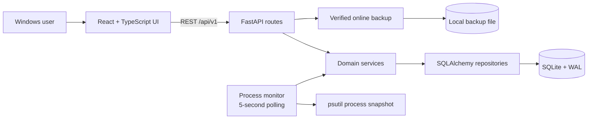

# Architecture

GameDeck is a local modular monolith: a React browser client, one FastAPI process, and one SQLite database. There are no cloud services, accounts, or background daemons.

## Session lifecycle

```mermaid
stateDiagram-v2
    [*] --> Absent
    Absent --> Active: registered process observed
    Active --> Active: repeated observation / heartbeat
    Active --> Grace: process disappears
    Grace --> Active: process returns before grace expires
    Grace --> Completed: grace expires
    Active --> Recovered: app restarts
    Recovered --> Active: process still running
    Recovered --> Completed: process absent; close at last heartbeat
```

The service layer makes start/stop operations idempotent, while a partial unique database index independently guarantees one active session per game. Different games may run concurrently. A failed process snapshot never closes sessions because absence was not actually observed.

## Data model

- `games` owns user-curated metadata and its compatible primary executable fields.
- `game_executables` is the process-identity registry: one primary mapping plus explicit aliases, with case-insensitive uniqueness among active games.
- `game_sessions` stores UTC start/end/heartbeat times and provenance.
- `settings` is a single row for tracker interval, restart grace, timezone, and week start.
- `purchases` is an optional local ledger using integer minor units and nullable game association.
- `fivem_servers`, `game_nights`, and `game_night_attendees` store manual companion workflows without external writes.
- `pc_profile` stores one manually curated hardware profile; live inventory is read only on request.
- Alembic owns every schema transition.

Analytics clips sessions to requested UTC intervals after deriving calendar boundaries in the saved IANA timezone. This prevents a session crossing midnight from being credited wholly to the day it started.

Spending analytics group records by currency without conversion. Cost-per-hour divides game-attributed purchase minor units by completed session seconds; unassigned subscriptions contribute to total spending but not game cost-per-hour.

## Deliberate tradeoffs

- Polling is portable, testable, and sufficient at a five-second cadence; WMI/event subscriptions add recovery and permission complexity.
- SQLite WAL is appropriate for one local writer and simple backups; PostgreSQL is unnecessary without remote multi-user access.
- A browser UI keeps V1 packaging simple. The API/UI boundary leaves room for a later desktop shell.
- Heartbeats make crash recovery honest but cannot reconstruct exact offline stop times. Manual correction remains a first-class feature.

See the [architecture decisions](decisions/0001-local-browser-first.md) and [operations guide](operations.md) for more detail.

The optional Steam reader is isolated behind preview and explicit import services. The Tauri desktop shell bundles the same React build and owns one FastAPI sidecar; browser and desktop clients share the REST contract. The local-first external-integration boundary is recorded in [ADR 0004](decisions/0004-local-first-integration-boundary.md).
